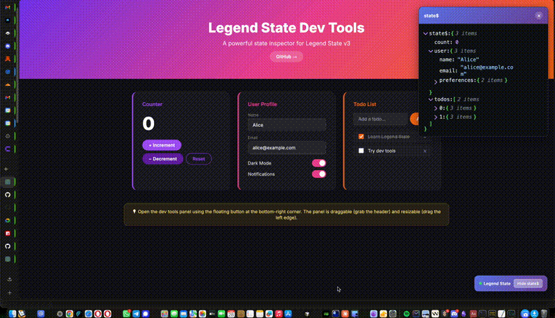

# legend-state-dev-tools

[](https://www.npmjs.com/package/legend-state-dev-tools)
[](./LICENSE)
[](https://github.com/apperside/legend-state-dev-tools)

**Visual dev tools for [Legend State](https://legendapp.com/open-source/state/v3/) v3** — inspect, edit, and export observable state in real time.

[**Live Demo**](https://apperside.github.io/legend-state-dev-tools/)



> **Alpha** — A personal tool I built for my own projects. It works well for my use cases, but it hasn't been battle-tested in production. Built for Legend State v3 only (not compatible with v1/v2). Contributions and feedback are welcome.

---

## Features

### Inspect

Browse your entire observable state as a collapsible tree. Every node updates in real time as state changes — no polling, no manual refresh.

### Edit

Click any value to edit it inline. Changes sync back to the underlying observable instantly, so your app reacts immediately.

### Real-time Updates

The dev tools subscribe directly to your observables. Every mutation — from any source — appears in the tree the moment it happens.

### Export

Download the full state tree (or any subtree) as JSON. Useful for debugging, bug reports, or snapshotting state at a specific point in time.

---

## Quick Start

```bash
npm install legend-state-dev-tools
```

```ts
import { observable } from '@legendapp/state';
import { init } from 'legend-state-dev-tools';
import 'legend-state-dev-tools/dist/styles.css';

const state$ = observable({ count: 0, user: { name: 'Alice' } });

const devtools = init(state$);

// Later, to clean up:
// devtools.destroy();
```

### Peer Dependencies

| Package | Version |
|---------|---------|
| `@legendapp/state` | `>= 3.0.0-beta.0` |
| `react` | `>= 18.0.0` |
| `react-dom` | `>= 18.0.0` |

---

## API Reference

### `init(observable$, options?)`

Mounts the dev tools UI and returns a handle for cleanup.

**Parameters**

| Parameter | Type | Description |
|-----------|------|-------------|
| `observable$` | `ObservableParam<any>` | The Legend State observable to inspect |
| `options` | `DevToolsOptions` | Optional configuration (see below) |

**Options**

| Option | Type | Default | Description |
|--------|------|---------|-------------|
| `enabled` | `boolean` | `true` | Enable or disable the dev tools |
| `readOnly` | `boolean` | `false` | Prevent editing of state values |
| `theme` | `string` | `'githubDark'` | Color theme for the JSON editor |
| `rootName` | `string` | `'state$'` | Label shown as the root node name |
| `position` | `'left' \| 'right'` | `'right'` | Side of the screen for the panel |

**Returns**

```ts
{ destroy: () => void }
```

Call `destroy()` to unmount the toolbar, panel, and state subscription.

---

## Themes

The following themes are available (provided by `json-edit-react`):

| Theme key | Description |
|-----------|-------------|
| `githubDark` | GitHub dark (default) |
| `githubLight` | GitHub light |
| `monoDark` | Monochrome dark |
| `monoLight` | Monochrome light |

---

## Roadmap

### Done

- Real-time state tree inspection
- Inline editing with instant sync
- Live observable subscription (zero polling)
- State export as JSON
- Multiple color themes (dark/light)
- Draggable toolbar
- Configurable panel positioning
- Read-only mode

### Coming

- Edit history with undo/redo
- Browser DevTools extension (Chrome / Firefox)

---

## Development

```bash
git clone https://github.com/apperside/legend-state-dev-tools.git
cd legend-state-dev-tools
npm install
npm run build   # build the core package
npm run dev     # build + start example dev server
```

A working example is included in `examples/basic/`.

---

## Architecture

Monorepo with the main package in `packages/core/` and examples in `examples/`.

| Module | Path | Role |
|--------|------|------|
| `index` | `packages/core/src/index.ts` | Public API (`init`, options, lifecycle) |
| `state-bridge` | `packages/core/src/state-bridge.ts` | Subscribes to observables, produces snapshots, writes back edits |
| `json-editor-mount` | `packages/core/src/ui/json-editor-mount.tsx` | Mounts the `json-edit-react` editor with theme resolution |
| `panel` | `packages/core/src/ui/panel.ts` | Slide-out panel DOM management |
| `toolbar` | `packages/core/src/ui/toolbar.ts` | Draggable floating toolbar |
| `template-engine` | `packages/core/src/ui/template-engine.ts` | Lightweight HTML templating (Eta) |
| `styles` | `packages/core/src/styles.css` | Panel and toolbar CSS |

---

## Contributing

Contributions are welcome! Feel free to open an issue or submit a pull request on [GitHub](https://github.com/apperside/legend-state-dev-tools).

---

## Acknowledgments

A huge thank you to [Carlos](https://github.com/CarlosNZ) for creating [`json-edit-react`](https://github.com/CarlosNZ/json-edit-react) — the excellent React component that powers the state tree viewer and editor in this project. Without it, these dev tools simply wouldn't exist.

## License

MIT
